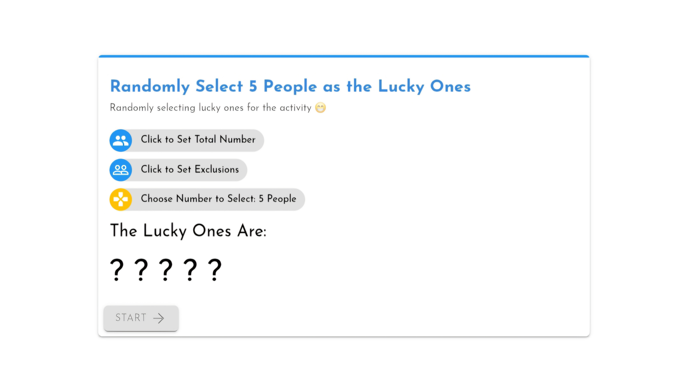

# 🎲 Randomizer-LuckyOne 🎉

| English | [简体中文](./assets/README-ZH.md) | [繁體中文](./assets/README-ZH-HK.md) |

**Randomizer-LuckyOne** is a simple and powerful web application designed to randomly select participants for activities, events, or any scenario that requires a random draw. Whether you're hosting a class, event, or team activity, this tool helps you randomly choose the lucky ones from a predefined list, with the added option of excluding certain participants. 🚀

> [!NOTE]
> Try online demo at [Here](https://lucky.caner.hk/en)

## Features ✨

- **Random Participant Selection**: Quickly select a random number of participants from a set of numbers (e.g., 1 to 42). 🎲
- **Exclusion List**: Allows you to exclude specific participants from the random selection. This helps in ensuring that certain individuals are not selected for specific activities (e.g., already selected or unavailable). 🚫
- **Dynamic Number Setting**: Easily set the total number of participants and the number of people to be selected. 🔢
- **Progress and Loading Indicators**: Visual indicators show progress as the selection is being made. The process ensures transparency and excitement. ⏳
- **Save Results**: After the selection, you can download the results in a neatly formatted HTML file, making it easy to share or reference later. 💾
- **User-Friendly Interface**: Built with a clean, intuitive UI using Material Design, ensuring a smooth user experience on both desktop and mobile devices. 📱💻

## How It Works 🛠️

1. **Set Total Participants**: Specify the total number of participants in your activity (e.g., 1 to 42). 📊
2. **Exclude Participants**: If necessary, select specific numbers to exclude from the draw. This is helpful if you want to skip certain people (e.g., someone already chosen). ❌
3. **Select Number of Winners**: Choose how many participants you'd like to randomly select. 🎉
4. **Start the Draw**: Click "Start" to initiate the random selection process. The app will show a fun animation as it randomly selects the winners. 🌀
5. **Download Results**: After the draw, you can download the results in an HTML file for easy sharing and record-keeping. 📂

---

## Deploy & Use 🛠️

Simply download the compressed package in [Releases](https://github.com/Caner-HK/Randomrizer-LuckyOne/releases), __decompress__ and deploy it on a web server. Wanna simpler? Just download, __decompress__ and double click the html file.

🎉Congrats! You're now ready to go.

> [!WARNING] 
> If you did not decompress the whole pack, then you are not able to see the page correctly. Accordingly, please do NOT report a issue if you even do not follow the such simple instruction.

---

## Technologies Used 🖥️

- **HTML5**: Structure and layout of the application.
- **CSS3 (MDUI)**: Styling with Material Design UI (MDUI) for a clean and responsive interface.
- **JavaScript**: Handles the logic for random selection, exclusions, and dynamic updates.
- **Blob**: For saving results in HTML format.

## Contributing 🤝

We welcome contributions from the community! If you have an idea to improve the project or fix a bug, feel free to fork the repository, make your changes, and create a pull request.

### Steps to Contribute:

1. Fork the repository 🍴
2. Clone your fork to your local machine 💻
3. Create a new branch (`git checkout -b feature/your-feature-name`) 🌱
4. Make your changes and commit them (`git commit -am 'Add new feature'`) 📝
5. Push to your branch (`git push origin feature/your-feature-name`) 🔼
6. Open a pull request 💬

## License 📝

This project is open source and available under the [MIT License](LICENSE).

## Contact 📬

- **Author**: [Felix Brown](https://github.com/iMallpa)
- **Repository**: [Randomizer-LuckyOne](https://github.com/Caner-HK/Randomrizer-LuckyOne)

---

Feel free to enhance this project, submit your contributions, and make it better! 🚀✨
