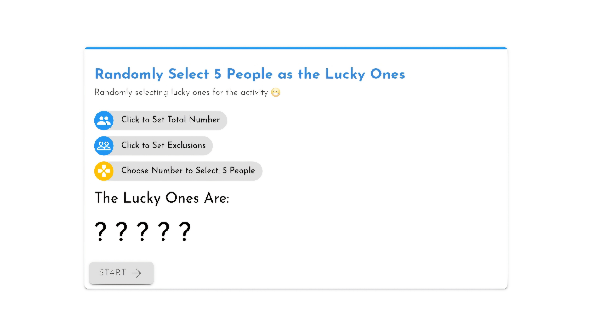
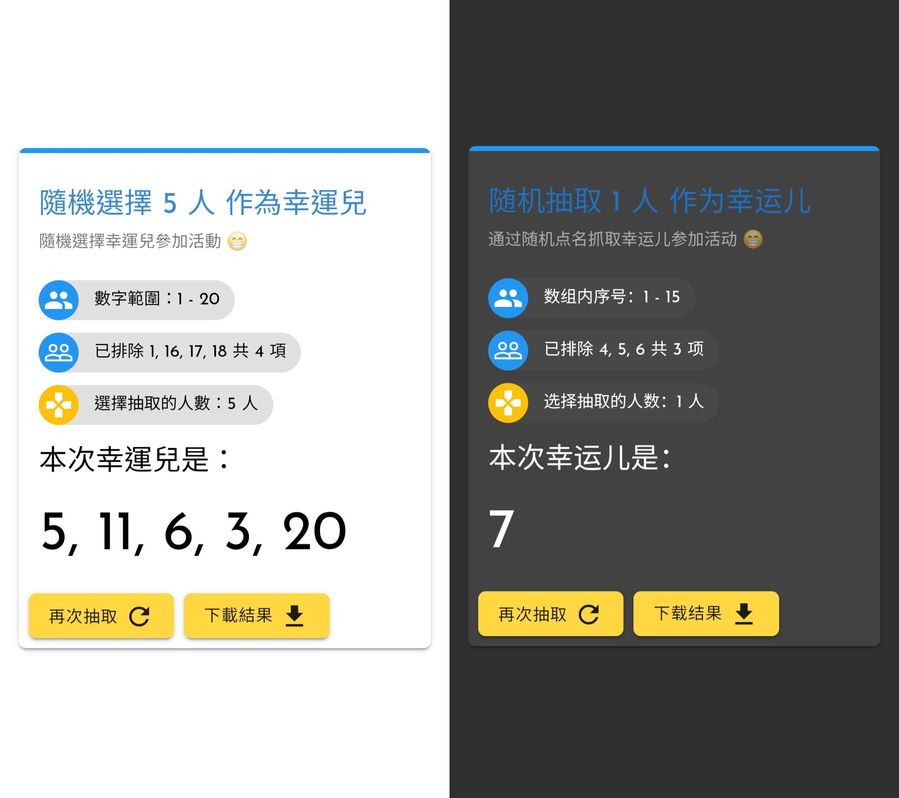

# 🎲 Randomizer-LuckyOne 🎉

| [English](../README.md) | 简体中文 | [繁體中文](./README-ZH-HK.md) |


**Randomizer-LuckyOne** 是一个简单但强大的随机抽取应用，适用于活动、课堂、会议等场景。你可以从指定范围内随机选择幸运儿，同时支持 **排除特定号码**，让抽取过程更加灵活！🚀

> [!NOTE]
> 在 [此处](https://lucky.caner.hk/zh) 尝试在线示范




## ✨ 功能特色

- **🎯 随机抽取**：可从 **1 - N** 之间随机抽取指定数量的幸运儿。
- **❌ 排除名单**：支持设定 **排除号码**，确保某些特定编号不会被抽中。
- **🔢 设置参与人数**：自由设定总人数范围（如 1 - 42），更加灵活。
- **⏳ 进度指示**：抽取过程中有动态进度条，提高趣味性和透明度。
- **💾 结果保存**：可将抽取结果 **下载为 HTML 文件**，方便记录与分享。
- **📱 响应式设计**：采用 **Material Design UI**，适配桌面端和移动端。

## 🛠️ 如何使用

1. **设置总人数**：输入 **参与抽取的总人数**（例如 **1 - 42**）。
2. **设定排除名单**（可选）：选择 **不参与抽取** 的号码，避免重复选择或特定需求。
3. **选择抽取人数**：决定 **要抽取的人数**（例如 **5 人**）。
4. **开始抽取**：点击 **「开始」** 按钮，系统将自动随机选取幸运儿 🎉。
5. **下载结果**（可选）：抽取结束后，你可以 **下载 HTML 结果文件**，方便记录和分享。

---

## 🔧 部署和使用
- 在 [Releases](https://github.com/Caner-HK/Randomrizer-LuckyOne/releases) 页面下载完整的 Zip 压缩文件，**部署至服务器**或**在本地打开**。
- 直接通过 [在线演示](https://lucky.caner.hk/) 使用。

🎉恭喜！你现在可以使用了。

> [!TIP] 
> 如果部署在您的服务器后无法加载样式文件，可以首先将 [资源文件](https://github.com/Caner-HK/Randomrizer-LuckyOne/tree/main/static) 上传至服务器，然后将 HTML 源码中的 ```<link>``` 和 ```<script>``` 标签中的链接改为您服务器上资源文件的 URL 地址。

---

## 🖥️ 技术栈

- **HTML5**：页面结构
- **CSS3 (MDUI)**：Material Design UI 组件库，提供美观的用户界面
- **JavaScript**：处理逻辑，包括随机抽取、动态更新、结果保存等
- **Blob API**：用于 **HTML 结果文件下载**

---

## 🤝 贡献方式

欢迎任何贡献！如果你有改进功能的想法，或者发现了 bug，可以 fork 代码并提交 PR 贡献你的代码！💡

### 贡献流程：
```bash
# 1️⃣ Fork 项目
# 2️⃣ 克隆到本地
git clone https://github.com/你的GitHub用户名/Randomrizer-LuckyOne.git

# 3️⃣ 创建新分支
git checkout -b feature/你的功能名称

# 4️⃣ 修改代码，提交更改
git commit -am "新增功能: xxx"

# 5️⃣ 推送到你的 Fork
git push origin feature/你的功能名称

# 6️⃣ 在 GitHub 上提交 PR
```

---

## 📜 许可证

本项目基于 **MIT 开源许可证**，可自由使用、修改和分发。

📄 **[MIT License](LICENSE)**

---

## 📬 联系方式

- **作者**：[Felix Brown](https://github.com/iMallpa)
- **仓库地址**：[Randomizer-LuckyOne](https://github.com/Caner-HK/Randomrizer-LuckyOne)

---

🎉 **欢迎丰富功能，提交你的贡献！** 🚀✨
